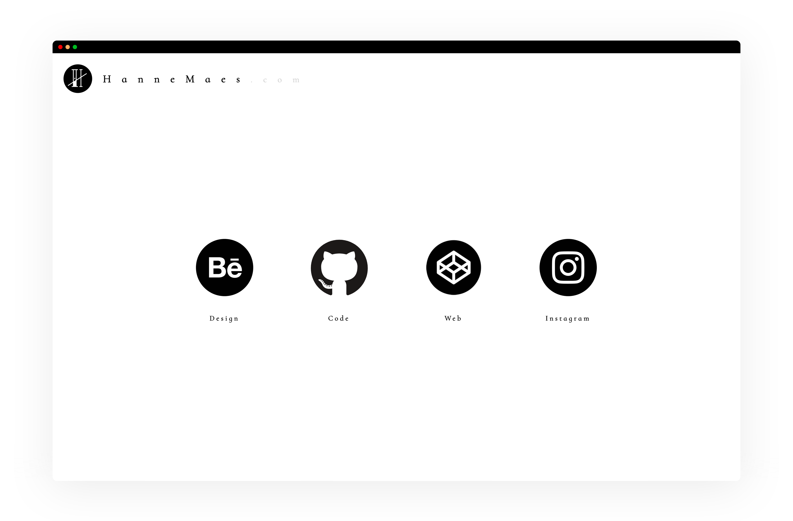

# HanneMaes.com

## Todo
- Update README.md screenshot
- Put the simple H/. logo at the bottom of the page
- Make a dark theme, change the website to dark at night and make a swith button on the top right
- When more content is added do the animation on scroll for desktop and do the animation on device tilt for mobile
- More readable favicon
